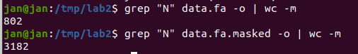
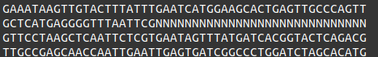
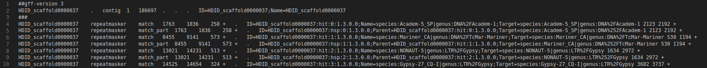
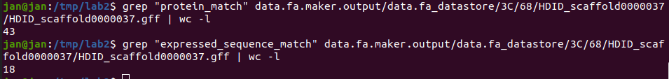
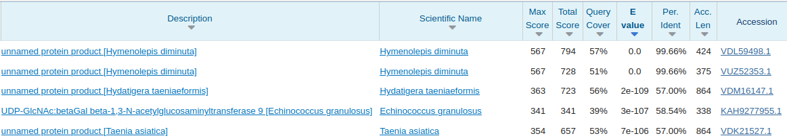

# Sprawozdanie z laboratorium drugiego
Hondra Piotr <br>
Jeschke Jan

## 1. Adnotacja DNA
### 1.1. Maskowanie genomu 
- Ile nukleotydów zostało zamaskowanych?



Zostało zamaskowanych 3182 - 802 = 2380 nukleotydów.
- Czy zamaskowane nukleotydy były pojedyńczymi nukleotydami, czy ciągami nukleotydów?



Zamaskowane nukleotydy były ciągami nukleotydów.
- Kolejnym etapem ćwiczenia będzie zmapowanie sekwencji mRNA i białek
na genom z zamaskowanymi sekwencjami repetytywnymi. W jaki sposób
maskowanie sekwencji repetytywnych może wpłynąć na wynik mapowania?

Maskowanie sekwencji repetytywnych pozwala osiągnąc lepsze wyniki. Redukukcja sekwencji ogranicza problem niejednoznaczności mapowania. Prowadzi to do zwiększenia precyzji mapowania oraz przyśpiesza sam proces mapowania.

### 1.2. Mapowanie znanych sekwencji i adnotacja strukturalna
```
maker_opts.ctl

#-----Genome (these are always required)
genome= /tmp/data.fa.masked
organism_type=eukaryotic #eukaryotic or prokaryotic. Default is eukaryotic

#-----Re-annotation Using MAKER Derived GFF3
maker_gff= #MAKER derived GFF3 file
est_pass=0 #use ESTs in maker_gff: 1 = yes, 0 = no
altest_pass=0 #use alternate organism ESTs in maker_gff: 1 = yes, 0 = no
protein_pass=0 #use protein alignments in maker_gff: 1 = yes, 0 = no
rm_pass=0 #use repeats in maker_gff: 1 = yes, 0 = no
model_pass=0 #use gene models in maker_gff: 1 = yes, 0 = no
pred_pass=0 #use ab-initio predictions in maker_gff: 1 = yes, 0 = no
other_pass=0 #passthrough anyything else in maker_gff: 1 = yes, 0 = no

#-----EST Evidence (for best results provide a file for at least one)
est= /tmp/hymenolepis_diminuta.PRJEB507.WBPS10.mRNA_transcripts.fa
altest= #EST/cDNA sequence file in fasta format from an alternate organism
est_gff= #aligned ESTs or mRNA-seq from an external GFF3 file
altest_gff= #aligned ESTs from a closly relate species in GFF3 format

#-----Protein Homology Evidence (for best results provide a file for at least one)
protein= /tmp/hymenolepis_diminuta.PRJEB507.WBPS10.protein.fa
protein_gff=  #aligned protein homology evidence from an external GFF3 file
...
```



- Jakie informacje można odcztać z wygenerowanego pliku .gff ?
  - Położenie i identyfikator
  - Typy cech
  - Struktura genetyczna
  - Atrybuty i metadane
  - Relacje i powiązania
- Oblicz ilość wygerowanych zdarzeń typu expressed_sequence_match i protein_match. Co oznaczają wymienione typy zdarzeń?





`Expressed_sequence_match` oznacza znalezienie sekwencji, która pasuje do sekwencji ekspresyjnej lub sekwencji transkryptu.

`Protein_match` odnosi się do pasującej sekwencji białkowej lub dopasowania do domeny białkowej.

### 1.3. Adnotacja funkcjonalna
Znaleziony w pliku .gff wiersz opisujący fragment genu zawierający w opisie znacznik `expressed_sequence_match`.
```
HDID_scaffold0000037    blastn    expressed_sequence_match    2662    4865    381    +    .    ID=HDID_scaffold0000037:hit:10:3.2.0.0;Name=HDID_0000718201-mRNA-1
```


- Co oznacza oraz jak interpretować wartość E-value?

`E-value` jest miarą oczekiwanego losowego wystąpienia dopasowania o prawdopodobieństwie równym lub lepszym zadanej wartości, tylko na podstawie przypadkowych trafień.

Interpretacja wartości `E-value` polega na porównaniu jej z ustalonym progiem istotności statystycznej. Im niższa wartość E-value, tym bardziej istotne jest dopasowanie.
- Zinterpretuj liste uzyskanych organizmów (w ćwiczeniu pracujemy na genomie tasiemca szczurzego Hymenolepis diminuta).

Zgodnie z oczekiwaniami `Hymenolepis diminuta` uzyskuje E-value na poziomie 0, a więc jest nalepiej dopasowany ze wszystkich innych pozycji. `Hydatigera taeniaeformis`, `Echinococcus granulosus`, `Taenia asiatica` to również tasiemce, które częściej jednak zasiedlają organizmy odpowiednio zwierząt drapieżnych lub ludzi. Dopasowanie jest również wysokie. Jest to zrozumiałe. To również tasiemce.
## 2. Zadanie implementacyjne
```python
import os
from Bio import SeqIO
from Bio.SeqRecord import SeqRecord

input_file = "data.fa"


filename, extension = os.path.splitext(input_file)
output_file = f"{filename}.rna{extension}"

records = SeqIO.parse(input_file, "fasta")

for record in records:
    rna_seq = record.seq.transcribe()
    rna_record = SeqRecord(rna_seq, id=record.id, description=record.description)
    SeqIO.write(rna_record, output_file, "fasta")

```